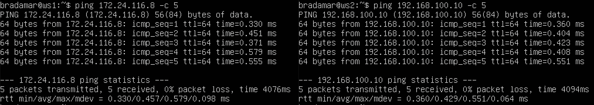
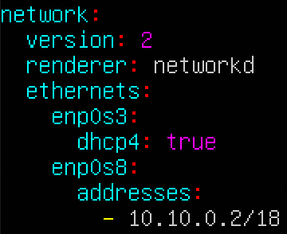
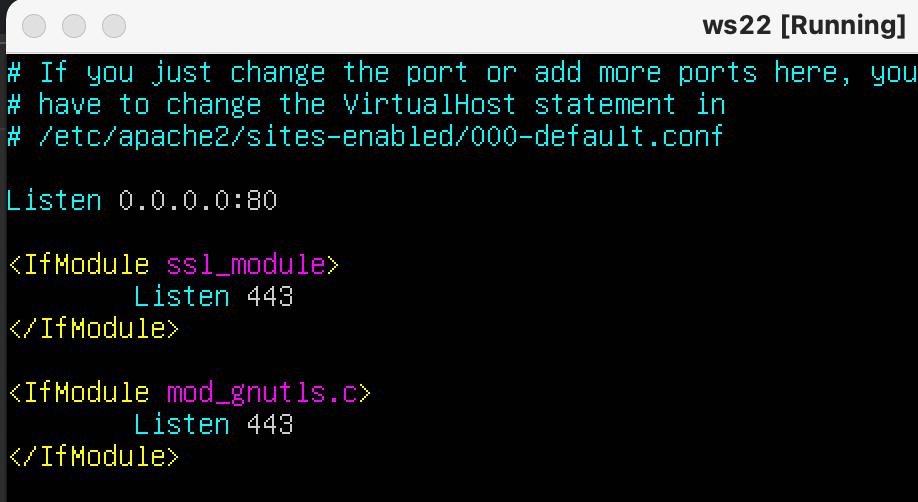

## Part 1. Инструмент ipcalc

### 1.1 Сети и маски
- Адрес сети 192.167.38.54/13: 

    Исходя из маски /13, а именно 255.248.0.0, адрес сети будет: 192.160.0.0

- Перевод масок:

    255.255.255.0 в префиксной записи - /24, в двоичной - 11111111.11111111.11111111.00000000

    /15 в обычном виде - 255.254.0.0, в двоичном - 11111111.11111110.00000000.00000000

    11111111.11111111.11111111.11110000 в обычном виде - 255.255.255.240, в префиксной записи - /28

- Минимальный и максимальный хост в сети 12.167.38.4

    При маске /8 минимальный хост 12.0.0.1, максимальный 12.255.255.254

    При маске 11111111.11111111.00000000.00000000 минимальный хост - 12.167.0.1, максимальный 12.167.255.254

    При маске 255.255.254.0 минимальный хост 12.167.38.1, маскимальный 12.167.39.254

    При маске /4 минимальный хост 0.0.0.1, максимальный 15.255.255.254

### 1.2 localhost

- Можно ли обратиться к приложению, работающему на localhost, со следующими IP: 194.34.23.100, 127.0.0.2, 127.1.0.1, 128.0.0.1

    

    Исходя из выводов команды "ping", разрешается обратиться только к адресам 127.0.0.2 и 127.1.0.1

### 1.3 Диапазоны и сегменты сетей

- Какие из перечисленных IP можно использовать в качестве публичного, а какие только в качестве частных: 10.0.0.45, 134.43.0.2, 192.168.4.2, 172.20.250.4, 172.0.2.1, 192.172.0.1, 172.68.0.2, 172.16.255.255, 10.10.10.10, 192.169.168.1

    В качестве частных сетей могут быть: 10.0.0.45, 192.168.4.2, 172.20.250.4, 192.172.0.1, 172.68.0.2, 172.16.255.255, 10.10.10.10, 192.169.168.1

    В качестве публичной сети могут быть: 134.43.0.2, 172.0.2.1

- Какие из перечисленных IP адресов шлюза возможны у сети 10.10.0.0/18: 10.0.0.1, 10.10.0.2, 10.10.10.10, 10.10.100.1, 10.10.1.255

    Из перечисленных IP адресов, учитывая маску /18 у сети 10.10.0.0 могут быть: 10.10.0.2, 10.10.10.10, 10.10.1.255

## Part 2. Статическая маршрутизация между двумя машинами

- С помощью команды ip a посмотреть существующие сетевые интерфейсы

    ws1

    

    ws2

    

- Описать сетевой интерфейс, соответствующий внутренней сети, на обеих машинах и задать следующие адреса и маски: ws1 - 192.168.100.10, маска /16, ws2 - 172.24.116.8, маска /12
- Выполнить команду netplan apply для перезапуска сервиса сети

    ws1

    

    ws2

    

### 2.1. Добавление статического маршрута вручную

- Добавить статический маршрут от одной машины до другой и обратно при помощи команды вида ip r add
- Пропинговать соединение между машинами

    Для ws1 используем "sudo ip r add 172.16.0.0/12 via 192.168.100.10, проверяем route через ip r и пингуем соединение до ws2

    ws1

    

    Для ws2 используем "sudo ip r add 192.168.0.0/16 via 172.24.116.8, проверяем route через ip r и пингуем соединение до ws1

    ws2

    

### 2.2. Добавление статического маршрута с сохранением

- Добавить статический маршрут от одной машины до другой с помощью файла etc/netplan/00-installer-config.yaml
- Пропинговать соединение между машинами

    Конфиг для ws1

    

    Конфиг для ws2

    

    Пингование между машинами

    

## Part 3. Утилита iperf3

- Перевести и записать в отчёт: 8 Mbps в MB/s, 100 MB/s в Kbps, 1 Gbps в Mbps

    1 байт = 8 бит
    8 Mbps = 1 MB/s
    100 MB/s = 800000 kbps
    1 Gbps = 1000 Mbps

- Измерить скорость соединения между ws1 и ws2

    Для измерения скорости используется утилита iperf3.
    Чтобы измерить скорость от ws1 к ws2, на ws2 нужно запустить сервер через iperf3 -s, затем на ws1 выполнить iperf3 -c 172.24.116.8, аналогично для ws2 с адресом 192.168.100.10

    ws1 -> ws2

    

    ws2 -> ws1

    

    Скорость в обоих случаях в среднем 5 Gbps.

## Part 4. Сетевой экран

### 4.1. Утилита iptables

 - Создать файл /etc/firewall.sh, имитирующий фаерволл, на ws1 и ws2:
1) На ws1 применить стратегию когда в начале пишется запрещающее правило, а в конце пишется разрешающее правило (это касается пунктов 4 и 5)

2) На ws2 применить стратегию когда в начале пишется разрешающее правило, а в конце пишется запрещающее правило (это касается пунктов 4 и 5)

3) Открыть на машинах доступ для порта 22 (ssh) и порта 80 (http)

4) Запретить echo reply (машина не должна "пинговаться”, т.е. должна быть блокировка на OUTPUT)

5) Разрешить echo reply (машина должна "пинговаться")
    
    ws1, сначала запрет, потом разрешение

    

    

    ws2, сначала разрешение, потом запрет

    

    

    Правила выполняются в порядке очереди сверху вниз, т.е. на первой машине, echo reply будет разрешен, на ws2 запрещен.

### 4.2. Утилита nmap

- Командой ping найти машину, которая не "пингуется", после чего утилитой nmap показать, что хост машины запущен

    Не пингуется ws1 с ws2, т.к. в firewall мы запретили echo-reply.

    Выполнение nmap на ws2 с адресом ws1
    
    

- Сохранить дампы образов виртуальных машин

    В VirtualBox manager жмем на пункт "меню" нужной нам машины, выбираем "Snapshots", затем "Take"

    

## Part 5. Статическая маршрутизация сети

### 5.1. Настройка адресов машин

- Настроить конфигурации машин в etc/netplan/00-installer-config.yaml согласно сети на рисунке.

    ws11

    

    r1

    

    r2

    

    ws22

    

    ws21

    

- Перезапустить сервис сети. Если ошибок нет, то командой ip -4 a проверить, что адрес машины задан верно. Также пропинговать ws22 с ws21. Аналогично пропинговать r1 с ws11.

    Сети на каждой машине перезапускаются командой "sudo netplan apply"

    ws11 - "ip -4 a" + ping r1

    

    r1 - "ip -4 a"

    

    r2 - "ip -4 a"

    

    ws22 - "ip -4 a"

    

    ws21 - "ip -4 a" + ping ws22

    

### 5.2. Включение переадресации IP-адресов.

- Для включения переадресации IP, выполните команду на роутерах: sysctl -w net.ipv4.ip_forward=1

    r1

    

    r2

    

- Откройте файл /etc/sysctl.conf и добавьте в него следующую строку: net.ipv4.ip_forward = 1

    r1

    

    r2

    

### 5.3. Установка маршрута по-умолчанию

- Настроить маршрут по-умолчанию (шлюз) для рабочих станций. Для этого добавить default перед IP роутера в файле конфигураций

    ws11 "ip r" + "ping r2"

    

    ws21 "ip r"

    

    ws22 "ip r"

    

    r2 "ip r" + "получение пинга с ws11"

    

    

### 5.4. Добавление статических маршрутов

- Добавить в роутеры r1 и r2 статические маршруты в файле конфигураций.

    r1

    

    r2

    

- Запустить команды на ws11: ip r list 10.10.0.0/[маска сети] и ip r list 0.0.0.0/0

    ws11

    

- "ip r list 10.10.0.0/[маска сети]" показывает пути именно к сети 10.10.0.0/18, а "ip r list 0.0.0.0/0 показывает пути к любой доступной сети с любой маской

### 5.5. Построение списка маршрутизаторов

- Запустить на r1 команду дампа: tcpdump -tnv -i enp0s8, при помощи утилиты traceroute построить список маршрутизаторов на пути от ws11 до ws21 - "traceroute 10.20.0.10

    ws11 traceroute to ws21

    

    r1 dump

    

    Traceroute подает запросы к сети с просьбой найти нужные адреса, реквесты выглядят как "Запрос в какой сети есть ip" и "скажи, что в этой ip"

### 5.6. Использование протокола ICMP при маршрутизации

- Запустить на r1 перехват сетевого трафика, проходящего через eth0 с помощью команды: tcpdump -n -i eth0 icmp

- Пропинговать с ws11 несуществующий IP (например, 10.30.0.111)

    ws11 ping 10.30.0.111

    

    r1 tcpdump

    

## Part 6. Динамическая настройка IP с помощью DHCP

- Для r2 настроить в файле /etc/dhcp/dhcpd.conf конфигурацию службы DHCP
- В файле resolv.conf прописать nameserver 8.8.8.8
- Перезагрузить службу DHCP командой systemctl restart isc-dhcp-server. Машину ws21 перезагрузить при помощи reboot и через ip a показать, что она получила адрес. Также пропинговать ws22 с ws21

    ws21 ip a

    

    ws22 ping to ws21

    

- Указать MAC адрес у ws11, для этого в etc/netplan/00-installer-config.yaml надо добавить строки: macaddress: 10:10:10:10:10:BA, dhcp4: true

    ws11 netplan conf

    

    Для r1 настроить аналогично r2, но сделать выдачу адресов с жесткой привязкой к MAC-адресу (ws11). Провести аналогичные тесты

    r1 dhcp.conf, в resolve.conf так же добавлен 8.8.8.8 адрес
    
    

    ws11 "ip a" отображение, что ип получен динамически у enp0s8

    

- Запросить с ws21 обновление ip адреса

    ws21 IP адрес до обновления (10.20.0.2)

    

    Теперь для обновления ip адреса нужно:

    "sudo dhclient -r" для освобождения адреса
    "sudo dhclient" для запроса адреса

    ws21 IP адрес после обновления (10.20.0.4)

    

## Part 7. NAT

- В файле /etc/apache2/ports.conf на ws22 и r1 изменить строку Listen 80 на Listen 0.0.0.0:80, то есть сделать сервер Apache2 общедоступным

    r1

    

    ws22

    

- Запустить веб-сервер Apache командой service apache2 start на ws22 и r1

    r1

    

    ws22

    

- Добавить в фаервол, созданный по аналогии с фаерволом из Части 4, на r2 следующие правила:

1) Удаление правил в таблице filter - iptables -F

2) Удаление правил в таблице "NAT" - iptables -F -t nat

3) Отбрасывать все маршрутизируемые пакеты - iptables --policy FORWARD DROP

    r2 firewall.sh

    

    Запускаем его аналогично Part 4: "sudo chmod -x /etc/firewall.sh && sudo bash /etc/firewall.sh

- Проверить соединение между ws22 и r1 командой ping

- При запуске файла с этими правилами, ws22 не должна "пинговаться" с r1

    ws22 to r1 ping

    

    r1 to ws22 ping

    

    Как видим, машины не соединяются

- Добавить в файл ещё одно правило:

4) разрешить маршрутизацию всех пакетов протокола ICMP

    Для этого нужно добавить две строчки в наш firewall.sh

    r2 новые строки firewall.sh

    

    Снова запускаем аналогично прошлому пункту

- Проверить соединение между ws22 и r1 командой ping

- При запуске файла с этими правилами, ws22 должна "пинговаться" с r1

    r1 to ws22

    

- Добавить в файл ещё два правила:

5) включить SNAT, а именно маскирование всех локальных ip из локальной сети, находящейся за r2 (по обозначениям из Части 5 - сеть 10.20.0.0)

6) включить DNAT на 8080 порт машины r2 и добавить к веб-серверу Apache, запущенному на ws22, доступ извне сети

    r2 firewall
    
    

- Проверить соединение по TCP для SNAT, для этого с ws22 подключиться к серверу Apache на r1 командой: telnet [адрес] [порт]

    ws22 apache

    

- Проверить соединение по TCP для DNAT, для этого с r1 подключиться к серверу Apache на ws22 командой telnet (обращаться по адресу r2 и порту 8080)

    r1 apache

    

## Part 8. Дополнительно. Знакомство с SSH Tunnels

- Запустить на r2 фаервол с правилами из Части 7

- Запустить веб-сервер Apache на ws22 только на localhost (то есть в файле /etc/apache2/ports.conf изменить строку Listen 80 на Listen localhost:80)

    ws22 apache port conf

    

- Воспользоваться Local TCP forwarding с ws21 до ws22, чтобы получить доступ к веб-серверу на ws22 с ws21

    Используем ssh подключение с ws21 к ws22 с флагом -L, указывая сначала localhost, затем адрес и порт ws22

    

    Запускаем telnet

    

- Воспользоваться Remote TCP forwarding c ws11 до ws22, чтобы получить доступ к веб-серверу на ws22 с ws11

    Используем ssh подключение c ws11 до ws22 с флагом -R, указывая сначала IP и порт ws22, затем указывая localhost

    

    Запускаем telnet

    